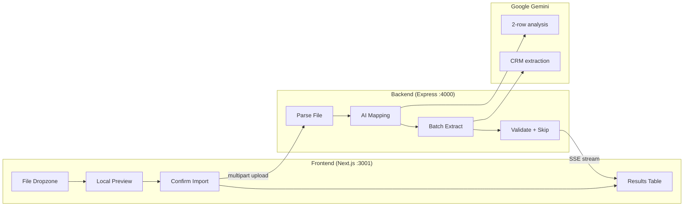

<div align="center">

# GrowEasy AI Lead Importer

**Intelligently map any spreadsheet into GrowEasy CRM — powered by Google Gemini**

[](https://nextjs.org/)
[](https://expressjs.com/)
[](https://www.typescriptlang.org/)
[](https://ai.google.dev/)

<br />

**Position Applied For:** Software Developer Intern  
**Author:** Pranav  
**Assignment Deadline:** 12 July 2026  
**Company:** [GrowEasy](https://groweasy.ai)

<br />

[Live Demo](#-live-demo) · [Features](#-features) · [Quick Start](#-quick-start) · [API](#-api-reference) · [Deploy](#-deployment)

</div>

---

## Overview

GrowEasy AI Lead Importer is a full-stack web application built for the GrowEasy developer assignment. It solves the **real** challenge of lead import: not parsing files, but **intelligently mapping arbitrary column names, layouts, and structures** into a fixed CRM schema using AI.

Whether the file comes from Facebook Lead Ads, Google Ads, a real estate CRM, a sales report, or a manually created Excel sheet — the system reads the data, understands the structure, and extracts clean CRM records.

```
Facebook Export     Google Ads CSV      Excel Sheet         Real Estate CRM
      │                    │                  │                    │
      └────────────────────┴──────────────────┴────────────────────┘
                                    │
                          Upload → Preview → Confirm
                                    │
                    ┌───────────────┴───────────────┐
                    │  Gemini AI (2-step mapping)   │
                    │  1. Read headers + 2 rows     │
                    │  2. Extract all records       │
                    └───────────────┬───────────────┘
                                    │
                          GrowEasy CRM JSON Output
```

---

## Live Demo

| Resource | URL |
|----------|-----|
| **Hosted Application** | https://groweasy.praanav.in |
| **GitHub Repository** | https://github.com/Pranav-stac/GrowEasy |
| **EC2 Public IP** | `3.110.30.167` (add DNS A record below) |
| **Local Frontend** | http://localhost:3001/lead-sources |
| **Local Backend** | http://localhost:4000/health |

### DNS setup (required for SSL)

Add this **A record** at your DNS provider for `praanav.in`:

| Type | Name | Value | TTL |
|------|------|-------|-----|
| A | `groweasy` | `3.110.30.167` | 300 |

After DNS propagates (5–30 min), SSL is issued automatically via Let's Encrypt for `pranav@praanav.in`.

> **Submission email:** varun@groweasy.ai — include live URL + GitHub repo + position (Intern / Full-Time)

---

## Features

### Core assignment requirements

| Step | Feature | Status |
|------|---------|--------|
| 1 | Drag & drop + file picker upload | Done |
| 2 | Client-side preview — **no AI until confirm** | Done |
| 3 | Sticky-header, scrollable responsive table | Done |
| 4 | Confirm Import button triggers backend only | Done |
| 5 | Results: imported, skipped, totals | Done |
| 6 | AI batch extraction with field mapping | Done |
| 7 | Skip records without email or mobile | Done |

### AI pipeline

- **Data-driven mapping** — Gemini reads headers + first 2 sample rows to infer column meanings (no hardcoded format rules)
- **Batch processing** — large files processed in configurable batches (default: 15 rows)
- **Retry mechanism** — failed AI batches retried up to 3 times with backoff
- **Token optimization** — compact prompts, array-based row format, truncated cell values
- **Token usage UI** — shows `500 / ~~1000~~` tokens with savings displayed

### Supported file formats

| Format | Extensions |
|--------|------------|
| CSV | `.csv` |
| Excel | `.xlsx`, `.xls`, `.xlsm`, `.xlsb` |
| Tab-separated | `.tsv` |
| Plain text | `.txt` (auto-detects delimiter) |
| OpenDocument | `.ods` |

**Max file size:** 5 MB

### Supported lead sources (examples)

- Facebook Lead Export
- Google Ads Export
- Excel spreadsheets
- Real Estate CRM exports
- Sales reports
- Marketing agency CSVs
- Manually created spreadsheets

### Bonus features implemented

- Drag & drop upload
- Real-time progress indicators (SSE streaming)
- Streaming API with Server-Sent Events
- Retry on failed AI batches
- Dark mode toggle
- Unit tests (15 tests, Vitest)
- Docker + docker-compose setup
- Token usage tracking & savings display
- Sample Excel file (`facebook_leads_export.xlsx`)
- Vercel + Railway deployment configs

---

## Tech Stack

| Layer | Technology |
|-------|------------|
| **Frontend** | Next.js 16, React 19, TypeScript, Tailwind CSS 4 |
| **Backend** | Node.js, Express 4, TypeScript |
| **AI** | Google Gemini 2.0 Flash (`@google/generative-ai`) |
| **Parsing** | csv-parse, SheetJS (xlsx) |
| **Validation** | Zod |
| **Testing** | Vitest |
| **DevOps** | Docker, docker-compose |
| **Database** | None (stateless architecture) |

---

## How It Works

### User flow

```
┌─────────────┐    ┌─────────────┐    ┌─────────────┐    ┌─────────────┐
│   Upload    │ →  │   Preview   │ →  │   Confirm   │ →  │   Results   │
│  drag/drop  │    │  raw table  │    │  AI import  │    │  CRM table  │
│  no AI yet  │    │  local parse│    │  Gemini API │    │  + skipped  │
└─────────────┘    └─────────────┘    └─────────────┘    └─────────────┘
```

### AI extraction (2-step)

**Step 1 — Column mapping (headers + 2 rows)**

Gemini inspects column names and actual cell values from the first 2 data rows and returns a mapping plan:

```json
{
  "detected_format": "Facebook lead export",
  "column_mappings": [
    { "csv_column": "full_name", "crm_field": "name" },
    { "csv_column": "phone_number", "crm_field": "mobile_without_country_code" },
    { "csv_column": "created_time", "crm_field": "created_at" }
  ]
}
```

**Step 2 — Batch extraction**

The mapping plan is applied to all rows in batches. Each batch is validated with Zod, phones are normalized, and records without email or mobile are skipped.

### Architecture



---

## CRM Fields

The AI extracts all 15 GrowEasy CRM fields:

| Field | Description |
|-------|-------------|
| `created_at` | Lead creation date |
| `name` | Lead name |
| `email` | Primary email |
| `country_code` | Country code (e.g. `+91`) |
| `mobile_without_country_code` | Mobile number (digits only) |
| `company` | Company name |
| `city` | City |
| `state` | State |
| `country` | Country |
| `lead_owner` | Lead owner |
| `crm_status` | Lead status |
| `crm_note` | Notes / remarks |
| `data_source` | Source |
| `possession_time` | Property possession time |
| `description` | Additional description |

### AI extraction rules

| Rule | Implementation |
|------|----------------|
| `crm_status` values | `GOOD_LEAD_FOLLOW_UP`, `DID_NOT_CONNECT`, `BAD_LEAD`, `SALE_DONE` |
| `data_source` values | `leads_on_demand`, `meridian_tower`, `eden_park`, `varah_swamy`, `sarjapur_plots` |
| Date format | `created_at` must be parseable by `new Date()` |
| Multiple emails | First → `email`, rest → `crm_note` |
| Multiple phones | First → mobile fields, rest → `crm_note` |
| Skip invalid | No email **and** no mobile → skipped |
| Missing values | Empty string `""`, never `null` |

---

## Quick Start

### Prerequisites

- **Node.js** 20+
- **npm**
- **Gemini API key** from [Google AI Studio](https://aistudio.google.com/apikey)

### 1. Clone & install

```bash
git clone https://github.com/YOUR_USERNAME/groweasy-csv-importer.git
cd groweasy-csv-importer

npm install
npm run install:all
```

### 2. Configure environment

**Backend** — create `backend/.env`:

```env
PORT=4000
GEMINI_API_KEY=your_gemini_api_key_here
GEMINI_MODEL=gemini-2.0-flash
BATCH_SIZE=15
MAX_RETRIES=3
CORS_ORIGIN=http://localhost:3000,http://localhost:3001
```

**Frontend** — create `frontend/.env.local`:

```env
NEXT_PUBLIC_API_URL=http://localhost:4000
```

### 3. Run development servers

```bash
npm run dev
```

| Service | URL |
|---------|-----|
| Frontend | http://localhost:3001/lead-sources |
| Manage Leads | http://localhost:3001/leads |
| Backend health | http://localhost:4000/health |

### 4. Test with sample files

1. Open **Lead Sources**
2. Click **Import CSV**
3. Upload a file from `samples/` (or download from the UI)
4. Preview raw data → click **Confirm Import**
5. View imported records and token usage

### 5. Run tests

```bash
npm test
```

---

## Sample Files

Included in `samples/` and downloadable from the Lead Sources page:

| File | Simulates |
|------|-----------|
| `facebook_leads_export.csv` | Facebook Lead Ads (`full_name`, `created_time`, `phone_number`) |
| `google_ads_export.csv` | Google Ads conversions (`First Name`, `Conversion Time`, `Phone Number`) |
| `real_estate_crm_export.csv` | Real estate CRM (`Client Name`, `Enquiry Date`, `Builder`, `Stage`) |
| `sales_report.csv` | Marketing / sales report (`contact`, `lead_date`, `campaign`) |
| `facebook_leads_export.xlsx` | Excel format sample |

---

## API Reference

### `GET /health`

Health check endpoint.

```json
{ "status": "ok", "timestamp": "2026-07-07T12:00:00.000Z" }
```

### `POST /api/import/preview`

Parse uploaded file without AI processing.

- **Body:** `multipart/form-data`, field name `file`
- **Response:** headers, rows, preview_rows, total_rows

### `POST /api/import/extract`

AI field extraction (single response).

- **Body:** `multipart/form-data`, field name `file`
- **Response:**

```json
{
  "imported": [{ "name": "John Doe", "email": "john@example.com", "...": "..." }],
  "skipped": [{ "row_index": 4, "raw_data": {}, "reason": "Record has neither email nor mobile number" }],
  "total_imported": 3,
  "total_skipped": 1,
  "total_rows": 4,
  "token_usage": {
    "tokens_used": 500,
    "baseline_tokens": 1000,
    "tokens_saved": 500
  }
}
```

### `POST /api/import/extract/stream`

Same as extract, but returns **Server-Sent Events** with progress updates.

```
data: {"type":"progress","processed":15,"total":50,"token_usage":{...}}
data: {"type":"complete","result":{...}}
```

### `GET /api/import/template`

Download a sample GrowEasy CRM CSV template.

---

## Project Structure

```
GrowEasy/
├── backend/
│   ├── src/
│   │   ├── index.ts                 # Express server entry
│   │   ├── routes/
│   │   │   └── import.ts            # Upload, extract, stream, template APIs
│   │   ├── services/
│   │   │   ├── aiExtraction.ts      # Gemini 2-step extraction + retries
│   │   │   └── prompts.ts           # AI prompts (mapping + extraction)
│   │   ├── types/
│   │   │   └── crm.ts               # CRM types, enums, interfaces
│   │   └── utils/
│   │       ├── spreadsheet.ts       # CSV, Excel, TSV parsing
│   │       ├── fileTypes.ts         # Supported extensions & MIME types
│   │       ├── phone.ts             # Phone normalization
│   │       └── tokens.ts            # Token counting & optimization
│   └── tests/                       # Vitest unit tests
│
├── frontend/
│   ├── src/
│   │   ├── app/
│   │   │   ├── lead-sources/        # Main import page
│   │   │   └── leads/               # Manage imported leads
│   │   ├── components/
│   │   │   ├── ImportModal.tsx      # 4-step import wizard
│   │   │   ├── CsvDropzone.tsx      # Drag & drop upload
│   │   │   ├── DataTable.tsx        # Sticky scrollable table
│   │   │   ├── ProgressBar.tsx      # AI processing progress
│   │   │   ├── TokenUsageBadge.tsx  # Token savings display
│   │   │   ├── Sidebar.tsx          # Dashboard navigation
│   │   │   └── UserProfile.tsx      # User profile card
│   │   └── lib/
│   │       ├── api.ts               # API client + file parsing
│   │       └── fileTypes.ts         # Supported format constants
│   └── public/samples/              # Downloadable sample files
│
├── samples/                         # Source sample CSV files
├── docker-compose.yml
├── Dockerfile
└── README.md
```

---

## Deployment

### Frontend — Vercel

1. Push code to GitHub
2. Import project in [Vercel](https://vercel.com) with root directory `frontend/`
3. Set environment variable:
   ```
   NEXT_PUBLIC_API_URL=https://your-backend-url.railway.app
   ```
4. Deploy

### Backend — Railway / Render

1. Create new service pointing to `backend/` directory
2. Set environment variables:
   ```env
   PORT=4000
   GEMINI_API_KEY=your_key
   GEMINI_MODEL=gemini-2.0-flash
   BATCH_SIZE=15
   MAX_RETRIES=3
   CORS_ORIGIN=https://your-frontend.vercel.app
   ```
3. Build command: `npm run build`
4. Start command: `npm start`

### Docker

```bash
# Set GEMINI_API_KEY in a .env file at project root
docker-compose up --build
```

| Service | Port |
|---------|------|
| Frontend | 3001 |
| Backend | 4000 |

---

## Environment Variables

### Backend (`backend/.env`)

| Variable | Default | Description |
|----------|---------|-------------|
| `PORT` | `4000` | Server port |
| `GEMINI_API_KEY` | — | Google Gemini API key (required) |
| `GEMINI_MODEL` | `gemini-2.0-flash` | Model name |
| `BATCH_SIZE` | `15` | Rows per AI batch |
| `MAX_RETRIES` | `3` | Retry attempts per failed batch |
| `CORS_ORIGIN` | `localhost:3000,3001` | Allowed frontend origins |

### Frontend (`frontend/.env.local`)

| Variable | Default | Description |
|----------|---------|-------------|
| `NEXT_PUBLIC_API_URL` | `http://localhost:4000` | Backend API base URL |

---

## Testing

```bash
# Run all backend tests
npm test

# Watch mode
npm run test:watch --prefix backend
```

| Test file | Covers |
|-----------|--------|
| `csv.test.ts` | CSV/TSV parsing, chunking, contact validation |
| `phone.test.ts` | Country code extraction, phone normalization |
| `tokens.test.ts` | Token rounding, baseline estimation, compact format |

---

## Submission Checklist

Before emailing **varun@groweasy.ai** (deadline: **12 July 2026**):

- [ ] Deploy frontend (Vercel) and backend (Railway/Render)
- [ ] Push to a **public GitHub repository**
- [ ] Update Live Demo URLs in this README
- [ ] Test all 4 sample files end-to-end with a real Gemini API key
- [ ] Email must include:
  - Hosted application URL
  - GitHub repository URL
  - Position: **Software Developer Intern** or **Software Developer (Full-Time)**

---

## Scripts

| Command | Description |
|---------|-------------|
| `npm run dev` | Start frontend + backend concurrently |
| `npm run dev:frontend` | Start Next.js only (port 3001) |
| `npm run dev:backend` | Start Express only (port 4000) |
| `npm run build` | Build both projects for production |
| `npm test` | Run backend unit tests |
| `npm run install:all` | Install dependencies in both packages |

---

## Author

**Pranav**  
GrowEasy Developer Assignment Submission — Software Developer Intern

---

<div align="center">

Built with care for [GrowEasy](https://groweasy.ai)

</div>
